# STIR-Net: Spatio-Temporal Instance Refinement Network

> **STIR-Net** stands for **Spatio-Temporal Instance Refinement Network** — a research-oriented 3D+t microscopy system for cell instance segmentation correction, graph-based spatial reasoning, motion-aware tracking, lineage inspection, and human-in-the-loop dataset curation.

**Focus:** 3D cell segmentation refinement and temporal cell tracking.

STIR-Net was developed while working on the **BioHub Cell Tracking During Development** challenge. The project began as a classical computer-vision cell segmentation and tracking pipeline, then evolved into a learned system after tracking experiments showed that temporal association could be handled much more effectively than the original hand-engineered tracker while segmentation errors remained a major source of downstream failures.

The resulting project combines **dense 3D geometric prediction**, **marker-controlled oversegmentation**, **region-adjacency-graph reasoning**, **global graph partitioning**, and **Trackastra-based temporal tracking**. A separate experimental temporal STIR-Net branch was also developed to inject historical tracking evidence back into uncertain spatial decisions. The repository additionally contains a full **dataset-curation and annotation workflow** used to inspect segmentation failures, correct supervoxels, edit tracks, and build curated training data.

> **Project status:** the spatial STIR-Net pipeline and Trackastra-based primary tracking are the most mature parts of the system. The custom temporal STIR-Net branch and learned track reconciler are research prototypes and are clearly separated from the promoted spatial path. This repository does **not** claim a final Kaggle leaderboard score or state-of-the-art benchmark result.

---

## Results at a Glance

<table>
<tr>
<td width="33%" align="center">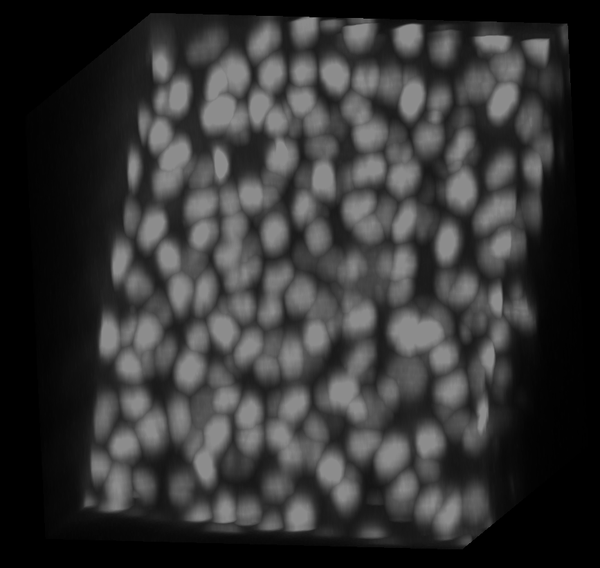</td>
<td width="33%" align="center">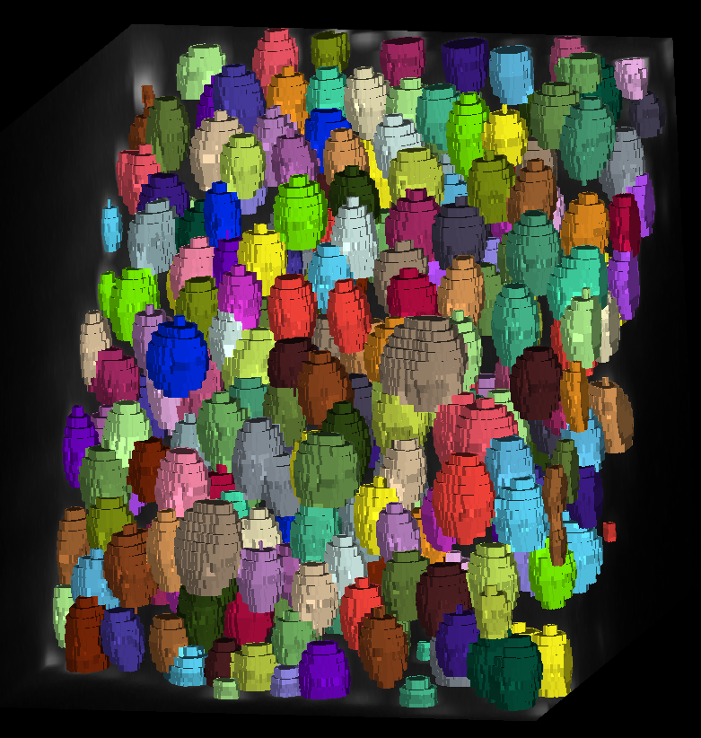</td>
<td width="33%" align="center">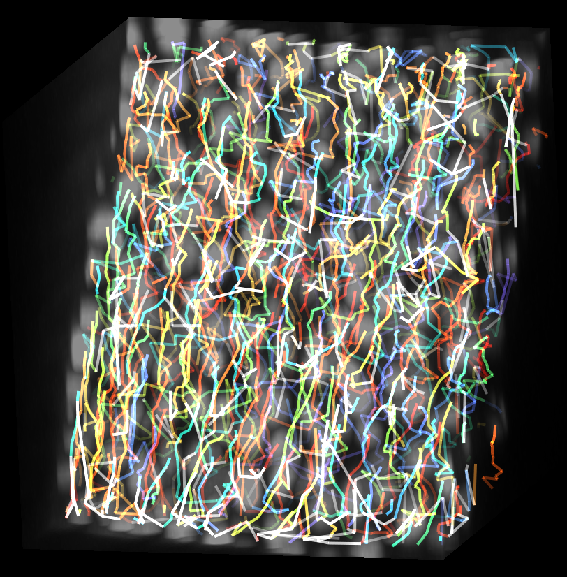</td>
</tr>
<tr>
<td align="center"><b>Raw 3D microscopy</b></td>
<td align="center"><b>Corrected cell instances</b></td>
<td align="center"><b>Temporal tracking</b></td>
</tr>
</table>

### Main technical contributions in this repository

- A **five-channel spatial input contract** combining normalized microscopy intensity with fallible source-segmentation priors.
- A **raw-authoritative evidence-fusion stem** that processes raw microscopy and segmentation priors separately and learns how strongly the priors should be trusted.
- An **anisotropy-aware residual 3D U-Net** whose downsampling direction is selected from the physical voxel spacing at runtime.
- A native-resolution **dense geometry decoder** predicting foreground, surface, inter-instance separator, signed distance, flow, centroid offset, and seed confidence.
- **Marker-controlled 3D watershed** that deliberately oversegments cells into atomic supervoxels before learned grouping.
- A **region adjacency graph (RAG)** with learned node/edge representations, interface evidence, optional morphology embeddings, and a calibrated graph partitioning stage.
- A production spatial path using **multicut-based partitioning** plus an asymmetric **source-core split-only** final correction stage.
- A **two-pass Trackastra pipeline with bootstrap global-motion compensation**, stabilization, and coordinate restoration.
- An experimental **temporal STIR-Net** branch using tracklet graph encoding, local physical cross-attention, reliability-gated edge updates, split/existence/recovery reasoning, and bounded local geometry refinement.
- A **unified dataset-curation package** for inference, spatial correction, tracking correction, lineage events, annotation progress, and reproducible cache management.
- A large numbered **investigation trail** documenting how the architecture evolved through failed hypotheses, overfit tests, watershed calibration, graph reasoning, temporal experiments, and generalization analysis.

---

## Table of Contents

- [Problem and Motivation](#problem-and-motivation)
- [Project Evolution](#project-evolution)
- [Current End-to-End Pipeline](#current-end-to-end-pipeline)
- [STIR-Net Architecture](#stir-net-architecture)
  - [1. Source Segmentation and Five-Channel Input](#1-source-segmentation-and-five-channel-input)
  - [2. Evidence Fusion](#2-evidence-fusion)
  - [3. Anisotropy-Aware 3D Spatial Backbone](#3-anisotropy-aware-3d-spatial-backbone)
  - [4. Dense Geometric Priors](#4-dense-geometric-priors)
  - [5. Atomic Supervoxel Construction](#5-atomic-supervoxel-construction)
  - [6. Region Adjacency Graph](#6-region-adjacency-graph)
  - [7. Spatial Graph Reasoning and Partitioning](#7-spatial-graph-reasoning-and-partitioning)
  - [8. Experimental Temporal Reasoning](#8-experimental-temporal-reasoning)
- [Primary Tracking and Global-Motion Compensation](#primary-tracking-and-global-motion-compensation)
- [Learned Track Reconciliation](#learned-track-reconciliation)
- [Dataset Curation and Annotation](#dataset-curation-and-annotation)
- [Research and Experimental Development](#research-and-experimental-development)
- [Results and Evaluation Philosophy](#results-and-evaluation-philosophy)
- [Generalization and Limitations](#generalization-and-limitations)
- [Repository Structure](#repository-structure)
- [Installation](#installation)
- [Usage](#usage)
- [Data Contract](#data-contract)
- [Testing](#testing)
- [Hardware and Runtime Notes](#hardware-and-runtime-notes)
- [External Components and Research Influences](#external-components-and-research-influences)
- [Project Status](#project-status)
- [License](#license)

---

# Problem and Motivation

The target problem is **3D cell instance segmentation and temporal lineage tracking** from fluorescence microscopy volumes. Each sample is a time series of anisotropic 3D volumes, and a complete solution must reason about both the spatial decomposition of a frame into individual cells and the temporal relationships between those cells across frames.

The challenge is not only detecting foreground. A useful system has to handle:

- touching and partially merged cells,
- fragmented source instances,
- weak or ambiguous boundaries,
- low signal-to-noise regimes,
- different cell shapes and densities,
- anisotropic voxel spacing,
- global embryo/stage motion,
- cells entering or leaving the field of view,
- broken trajectories,
- appearance and disappearance events,
- cell division and lineage structure.

---

# Project Evolution

The repository intentionally preserves the development path rather than presenting the final architecture as if it appeared fully formed.

```text
Classical preprocessing + thresholding
                |
                v
Distance transform + watershed source segmentation
                |
                v
Classical frame-to-frame association / Hungarian tracking
                |
                v
Trackastra evaluation
                |
                +----> substantially stronger temporal association
                |
                v
Segmentation becomes the apparent bottleneck
                |
                v
STIR-Net V1
                |
                +----> unsuccessful / insufficient architecture
                |
                v
STIR-Net redesign
                |
                v
Dense geometric evidence + atomic supervoxels
                |
                v
Learned spatial RAG + global partitioning
                |
                v
Improved spatial refinement on the main development regime
                |
                v
Temporal STIR-Net investigations
                |
                v
Dataset curation + real temporal annotations
                |
                v
Global-motion-aware Trackastra + learned track-repair research
                |
                v
Comparison against mature joint spatial/temporal alternatives
                |
                v
Competition-oriented custom-model development concluded
```

The important research mistake was also useful: after one strong pretrained segmentation approach still exhibited segmentation errors, development moved too quickly toward a custom architecture instead of first benchmarking a broader set of mature segmentation/tracking systems. Later experiments with alternatives such as Cellpose + Ultrack suggested that several difficult cases could already be handled effectively by existing spatial-temporal frameworks. That changed the expected value of continuing to expand STIR-Net specifically for the competition.

The repository is therefore best read as both a working pipeline and a record of **iterative ML system development**: hypothesis, implementation, failure analysis, controlled overfit tests, architectural redesign, tooling, and eventual strategy revision.

---

# Current End-to-End Pipeline

The active project architecture is organized around explicit stages rather than the earlier classical pipeline.

```text
BioHub raw 3D+t volume
        |
        v
Source instance generation
src/source_instances/
        |
        v
STIR-Net spatial refinement
learned/stirnet/
        |
        v
Primary tracking
src/tracking/trackastra/
        |
        |-- Trackastra pass 1 in source coordinates
        |-- estimate global motion from reliable continuations
        |-- lazily stabilize raw + instance movies
        |-- Trackastra pass 2 in stabilized coordinates
        `-- restore graph coordinates to the source frame
        |
        v
Learned track reconciliation [research / being finalized]
learned/track_reconciler/
        |
        v
Export / competition representation
```

The corresponding orchestration contract lives in [`src/pipeline/`](src/pipeline/). The current runner composes:

1. source instances,
2. STIR-Net spatial refinement,
3. primary tracking,
4. track stitching/reconciliation,
5. export.

The learned track-reconciliation stage is intentionally explicit. The active pipeline does **not** silently fall back to the historical heuristic stitcher when that stage is unavailable.

---

# STIR-Net Architecture

<p align="center">
  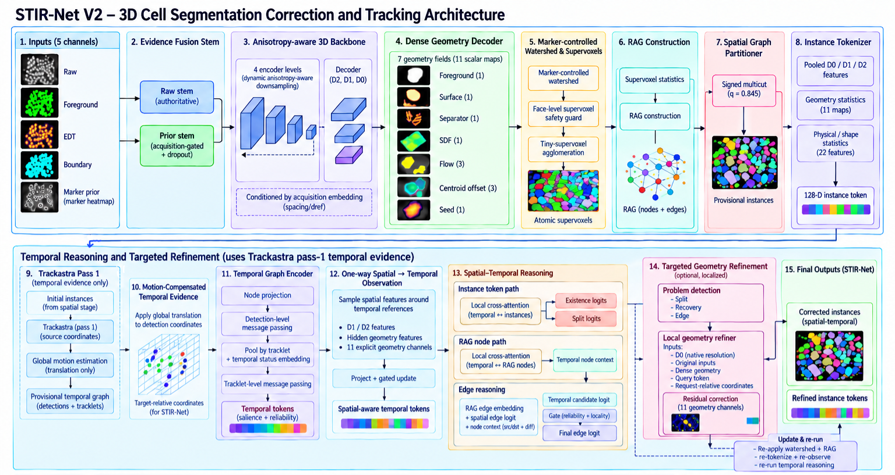
</p>

The central architectural rule of the redesigned model is:

> **Dense geometry first, sparse temporal reasoning second.**

The current frame is first treated as a complete 3D instance-segmentation problem. Temporal evidence is allowed to inspect spatial representations, modify uncertain graph decisions, and request bounded local refinement, but it does not replace the native spatial trunk.

At a high level:

```text
raw image + source-segmentation priors
                |
                v
raw/prior evidence fusion
                |
                v
anisotropy-aware residual 3D U-Net
                |
                v
native dense geometry
{foreground, surface, separator, SDF,
 flow, centroid offset, seed}
                |
                v
marker-controlled 3D watershed
                |
                v
atomic supervoxels
                |
                v
region adjacency graph
                |
                v
learned spatial edge reasoning
                |
                v
multicut / connected graph partition
                |
                v
provisional 3D cell instances
                |
                +-----------------------------+
                |                             |
                v                             v
         instance tokens             temporal detection graph
                |                             |
                +------ local physical -------+
                       cross-attention
                              |
                              v
                   gated temporal updates
                              |
                              v
                  optional local refinement
                              |
                              v
                   final graph partition
```

## 1. Source Segmentation and Five-Channel Input

STIR-Net does not receive only the raw volume. The production input contract contains five aligned 3D channels:

1. **Raw / preprocessed microscopy intensity**
2. **Current foreground prior** from the source segmentation
3. **Current EDT prior** (distance-to-boundary information normalized by a cell reference scale)
4. **Current instance-boundary prior**
5. **Current marker prior**, derived from the strongest interior EDT position of each source instance

These channels are defined in [`learned/stirnet/data/sample_builder.py`](learned/stirnet/data/sample_builder.py) and built by the production spatial input path in [`learned/stirnet/inference/spatial_input.py`](learned/stirnet/inference/spatial_input.py).

<table>
<thead>
<tr>
<th align="left">Input</th>
<th align="center">Example</th>
<th align="left">Explanation</th>
</tr>
</thead>
<tbody>
<tr>
<td><b>Raw microscopy</b></td>
<td align="center">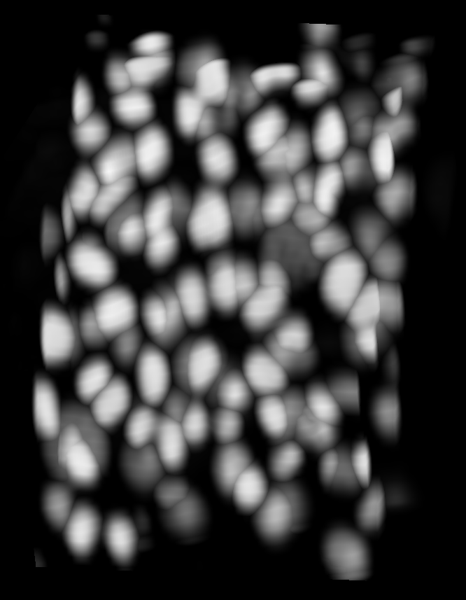</td>
<td>Preprocessed fluorescence intensity. This is the authoritative visual evidence and is processed through a dedicated raw-image stem so STIR-Net can recover information that is missing or incorrect in the source segmentation.</td>
</tr>
<tr>
<td><b>Foreground prior</b></td>
<td align="center">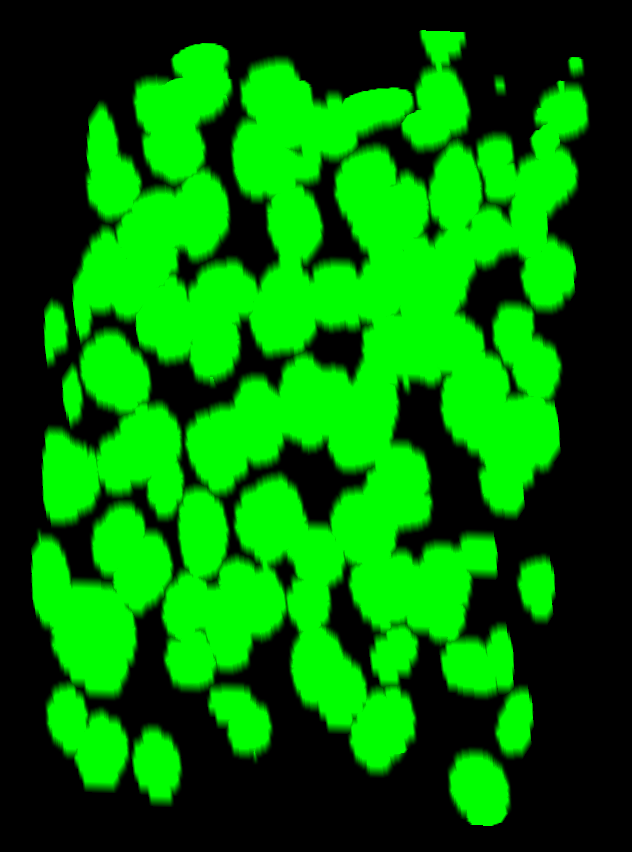</td>
<td>Binary occupancy prior derived from the source instance segmentation. It indicates voxels currently believed to belong to cells, but is treated as fallible evidence rather than ground truth.</td>
</tr>
<tr>
<td><b>EDT prior</b></td>
<td align="center">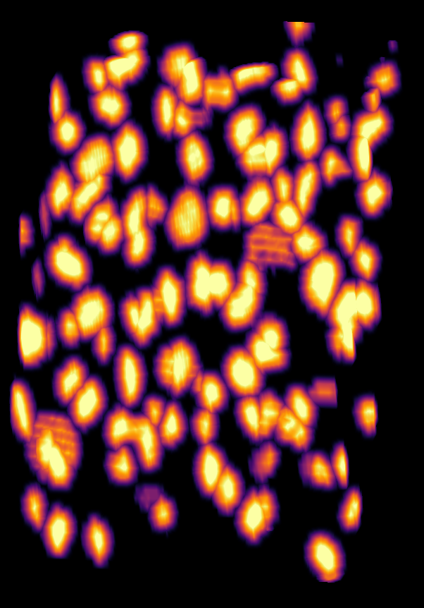</td>
<td>Per-instance Euclidean distance transform, normalized by the current cell reference scale <code>dref_um</code>. It encodes how deep each voxel lies inside its proposed source instance and provides useful interior geometry.</td>
</tr>
<tr>
<td><b>Boundary prior</b></td>
<td align="center">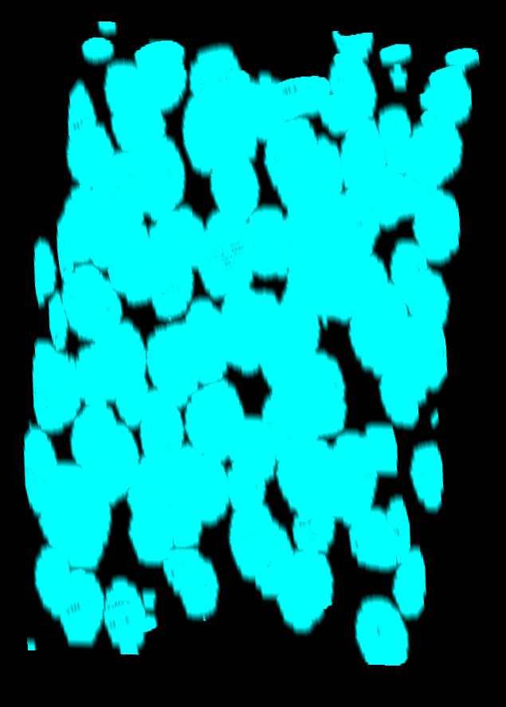</td>
<td>Boundary map derived from the current source instance labels. It supplies the network with the interfaces proposed by the initial segmentation while still allowing raw-image evidence to contradict them.</td>
</tr>
<tr>
<td><b>Center-marker prior</b></td>
<td align="center">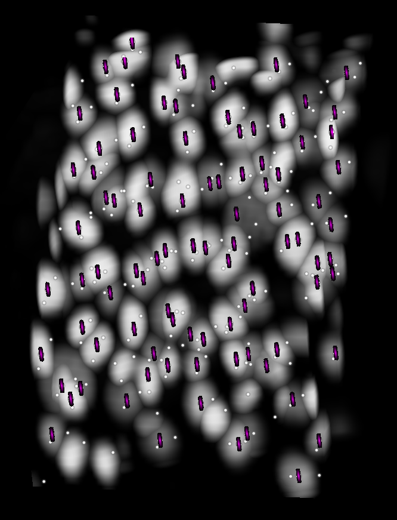</td>
<td>One interior marker per source instance, placed at the strongest EDT location. These markers provide a compact initialization cue for instance geometry and watershed reasoning.</td>
</tr>
</tbody>
</table>

### Source-instance front end

The source-instance stage is deliberately independent of STIR-Net. For each frame, the production front end performs:

```text
raw volume
    -> preprocessing
    -> binary foreground mask
    -> source instance segmentation
    -> detected cells + handcrafted source features
```

This stage provides a useful but **fallible prior**. The redesigned STIR-Net architecture was explicitly built so that a wrong source mask is not treated as ground truth.

### Cell reference scale (`dref_um`)

Several spatial quantities are normalized by a per-frame cell reference scale. In production inference this scale is estimated from the **current segmentation**, not from ground truth. It is used to express distances, neighborhoods, and geometry in approximately cell-scale units while still retaining physical spacing in micrometres.

---

## 2. Evidence Fusion

The original model treated all channels symmetrically. The redesigned [`EvidenceFusionStem`](learned/stirnet/model/spatial/evidence_stem.py) separates **raw microscopy evidence** from the four segmentation-derived priors.

```text
raw microscopy --------------------> raw stem -----+
                                                   |
source segmentation priors --------> prior stem ---+--> gated fusion --> spatial trunk
                                     ^             |
                                     |             |
                           acquisition-conditioned gate
```

Important behavior:

- raw microscopy has its **own feature stem**;
- prior channels have a separate feature stem;
- an acquisition-conditioned learned gate controls how much prior evidence enters the fused representation;
- the prior gate starts conservatively rather than fully trusting the source segmentation;
- **prior dropout** is used during training so the network cannot collapse into copying the source segmentation;
- raw evidence therefore remains available when the current source mask misses or badly represents a cell.

This design was introduced specifically to make the network robust to the fact that the input segmentation is a noisy proposal rather than an authoritative label map.

---

## 3. Anisotropy-Aware 3D Spatial Backbone

The spatial backbone is a residual 3D U-Net implemented in [`learned/stirnet/model/spatial/backbone.py`](learned/stirnet/model/spatial/backbone.py).

The default channel hierarchy is:

```text
24 -> 48 -> 96 -> 192
```

with residual blocks at each level and a mirrored decoder returning native-resolution `D0` features together with lower-resolution decoder representations.

A key detail is that the model does **not** blindly downsample all axes by the same amount. The data are anisotropic, so the backbone chooses downsampling strides using the current physical voxel spacing. This allows the receptive field to grow more isotropically in physical space even when the Z spacing is much coarser than X/Y.

The production BioHub inference configuration currently defaults to:

```text
spacing (Z, Y, X) = (1.625, 0.40625, 0.40625) micrometres
```

and tiled spatial inference defaults to:

```text
tile shape   = (32, 128, 128)
tile overlap = ( 8,  32,  32)
tile halo    = ( 4,  16,  16)
```

Activation checkpointing is supported for memory-constrained training.

---

## 4. Dense Geometric Priors

The native-resolution decoder does not predict only a foreground probability. It produces multiple complementary geometric fields from a shared residual trunk:

| Output | Channels | Purpose |
|---|---:|---|
| Foreground logits | 1 | Cell occupancy |
| Surface logits | 1 | Outer cell-surface evidence |
| Separator logits | 1 | Inter-instance separation evidence |
| Signed distance field (SDF) | 1 | Signed object geometry |
| Flow | 3 | Local geometric direction field |
| Centroid offset | 3 | Vector from local voxel geometry toward the instance centroid |
| Seed logits | 1 | Marker confidence for instance initialization |

The implementation lives in [`learned/stirnet/model/geometry/decoder.py`](learned/stirnet/model/geometry/decoder.py).

<table>
<thead>
<tr>
<th align="left">Predicted prior</th>
<th align="center">Example</th>
<th align="left">Explanation</th>
</tr>
</thead>
<tbody>
<tr>
<td><b>Foreground</b><br><sub>1 channel</sub></td>
<td align="center">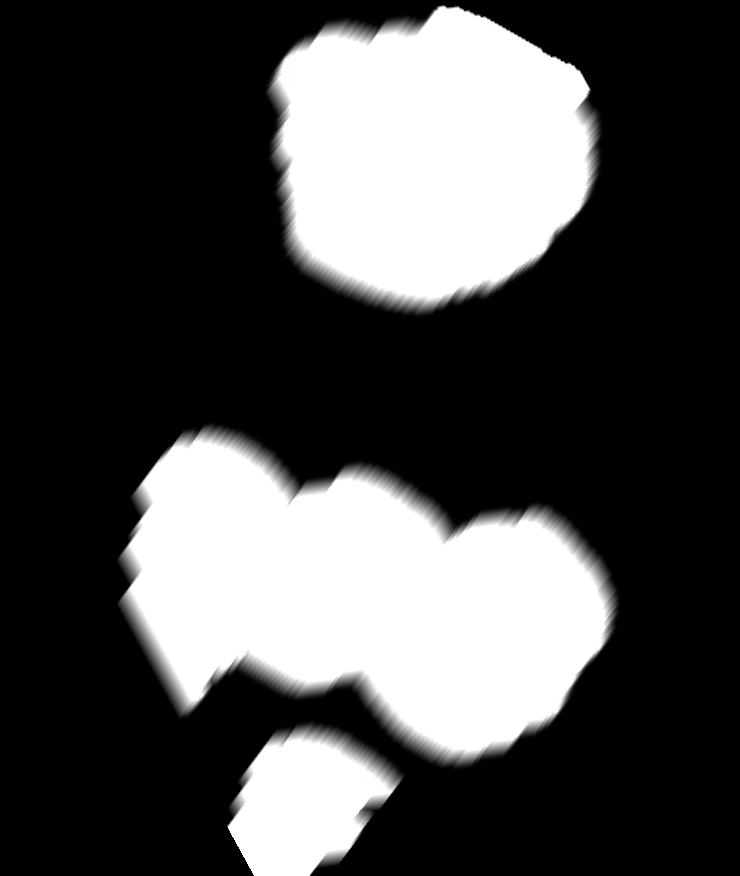</td>
<td>Learned cell-occupancy probability. It provides STIR-Net's own estimate of where cellular material exists instead of relying only on the source foreground mask.</td>
</tr>
<tr>
<td><b>Surface</b><br><sub>1 channel</sub></td>
<td align="center">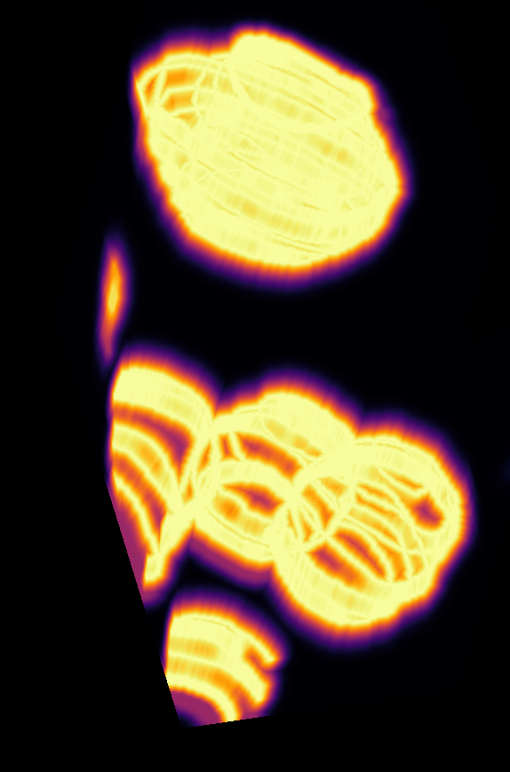</td>
<td>Learned evidence for the outer surface of cells. It helps distinguish the external cell/background interface from boundaries occurring between touching cells.</td>
</tr>
<tr>
<td><b>Separator</b><br><sub>1 channel</sub></td>
<td align="center">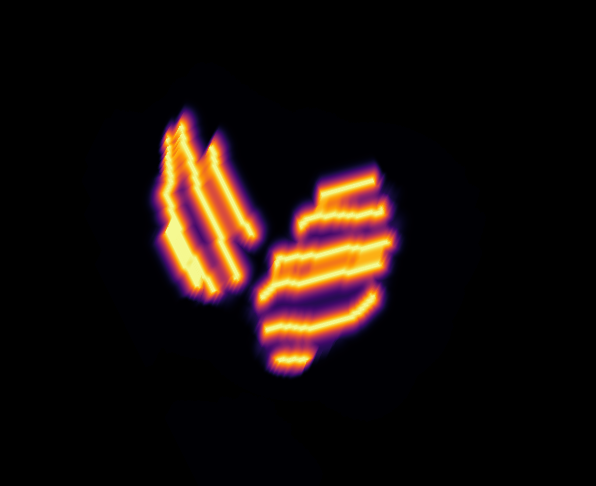</td>
<td>Learned inter-instance separation evidence. High responses indicate locations where adjacent cellular regions are likely to belong to different biological cells, making this field especially important for correcting merged source instances.</td>
</tr>
<tr>
<td><b>Signed distance field (SDF)</b><br><sub>1 channel</sub></td>
<td align="center">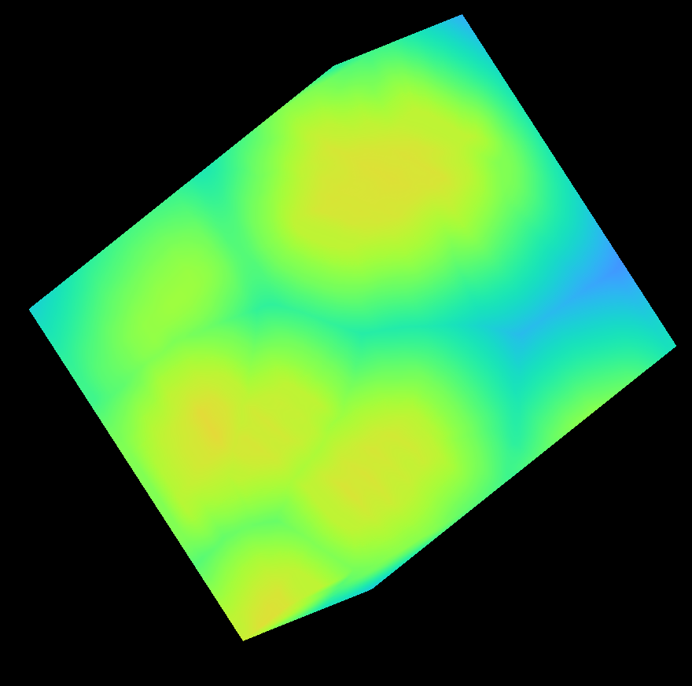</td>
<td>Continuous signed geometric representation of cell interiors and exteriors, bounded in cell-reference units. It carries richer shape information than a binary occupancy map and contributes to marker and watershed reasoning.</td>
</tr>
<tr>
<td><b>Flow</b><br><sub>3 channels</sub></td>
<td align="center">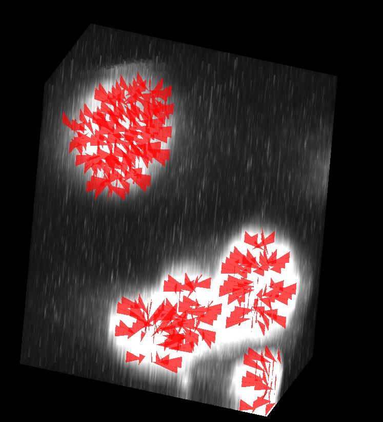</td>
<td>Three-dimensional local direction field derived from learned cell geometry. Directional agreement and disagreement are later used as cues when deciding whether neighboring supervoxels belong to the same instance.</td>
</tr>
<tr>
<td><b>Centroid offset</b><br><sub>3 channels</sub></td>
<td align="center">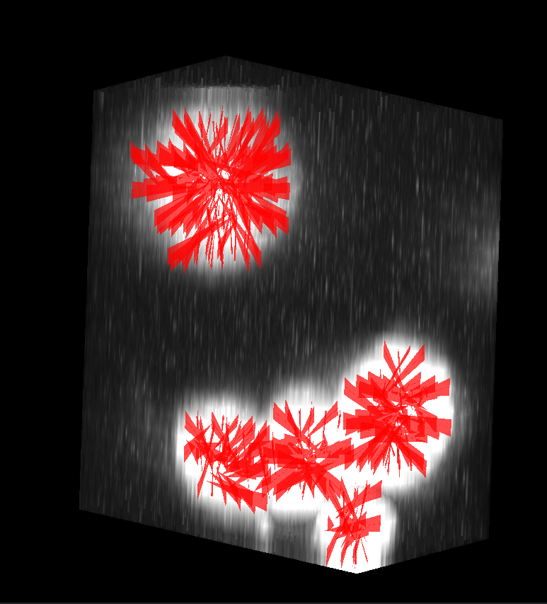</td>
<td>For each voxel, the network predicts a 3D offset toward the corresponding instance centroid. This provides redundant instance-grouping evidence and allows neighboring regions to be compared by whether they point toward compatible object centers.</td>
</tr>
<tr>
<td><b>Seed score</b><br><sub>1 channel</sub></td>
<td align="center">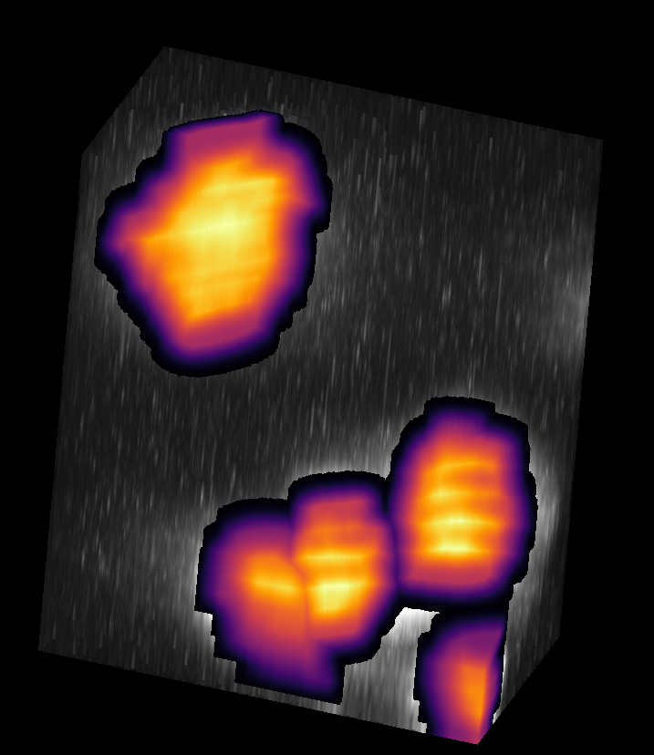</td>
<td>Learned confidence for potential instance markers. Combined with SDF and other geometric evidence, it supports the deliberately over-segmenting marker-controlled watershed used to construct atomic supervoxels.</td>
</tr>
</tbody>
</table>

### Why use several geometric fields?

Different failure modes expose different evidence:

- foreground says **where cells are**;
- surface and separator distinguish outer boundaries from interfaces between touching cells;
- SDF represents object interior/exterior structure without reducing a cell to one point;
- flow provides local directional consistency;
- centroid offsets provide redundant instance-grouping evidence;
- seed confidence supports deliberate oversegmentation for downstream graph reasoning.

The model therefore has multiple ways to detect disagreement between the source segmentation and the raw image geometry.

### Research influences

The geometry representation was inspired by ideas used in Omnipose-style distance/flow representations, NucMM-style foreground/contour/distance combinations, NISNet3D-style learned 3D vector evidence, and PlantSeg-style oversegmentation followed by graph partitioning. These systems influenced the design; the implementation here is project-specific.

---

## 5. Atomic Supervoxel Construction

A core design decision is to avoid predicting final cells as independent overlapping masks. Instead, STIR-Net creates **atomic supervoxels** and asks the graph model which adjacent regions should be grouped.

<table>
<tr>
<td align="center">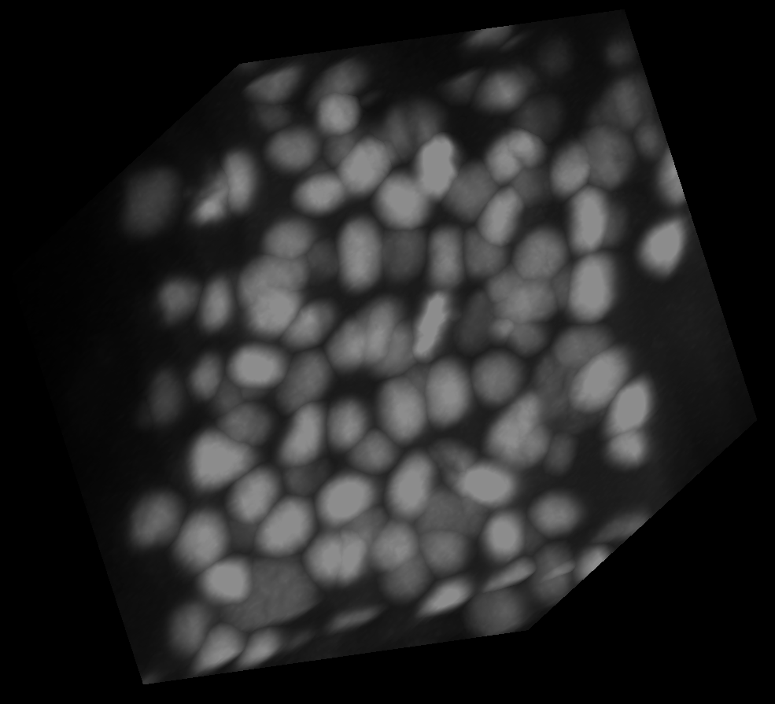</td>
<td align="center">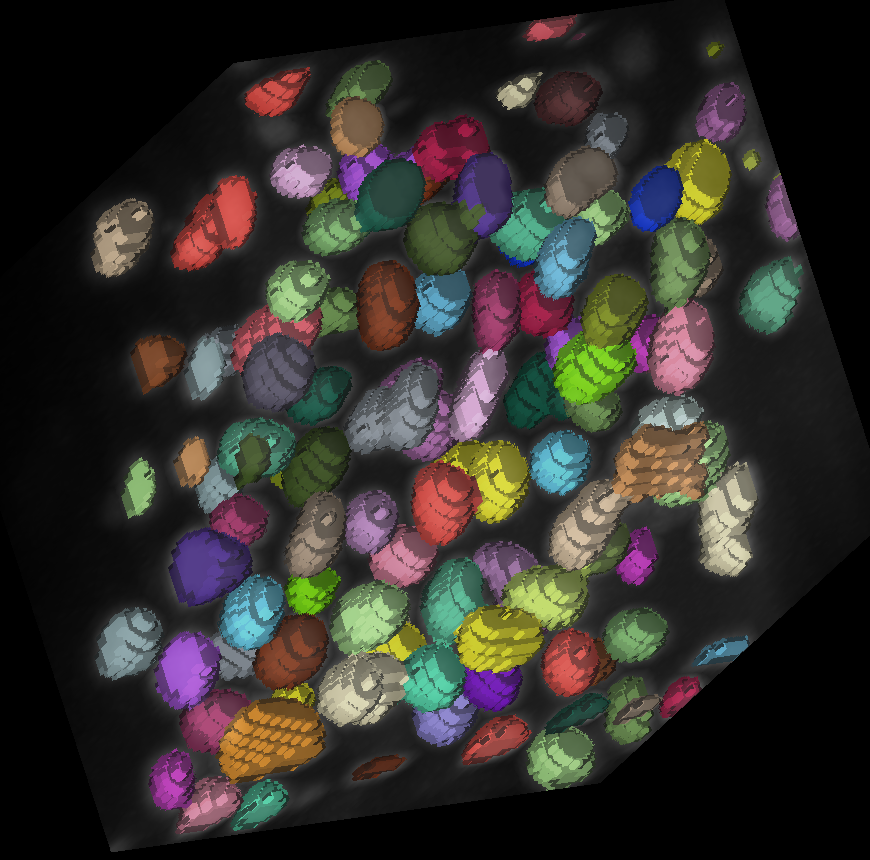</td>
<td align="center">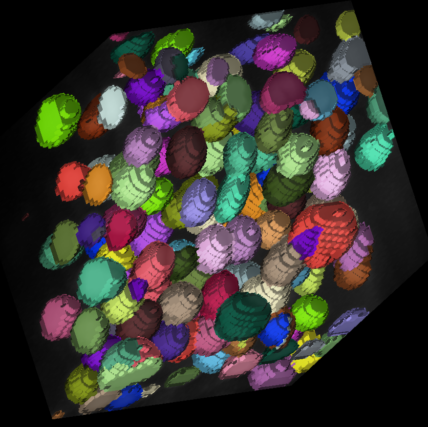</td>
<td align="center">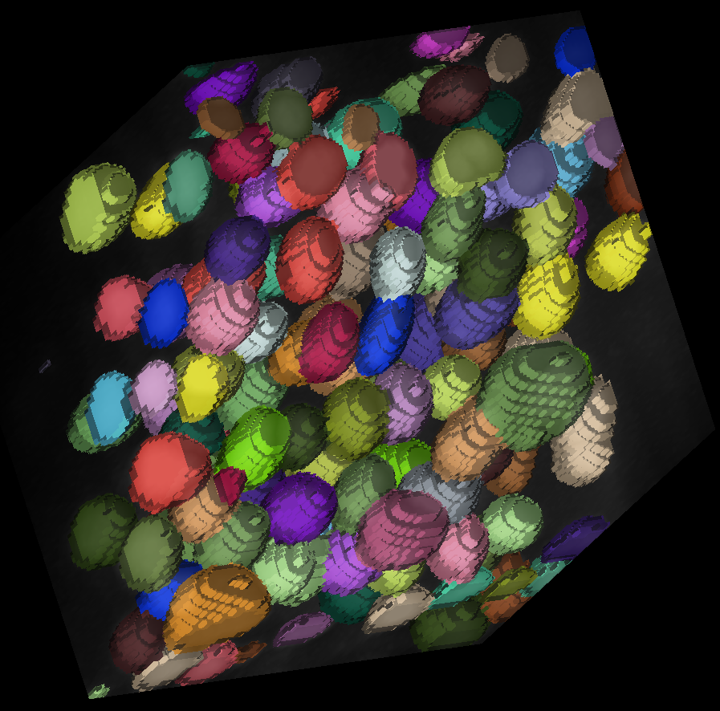</td>
</tr>
<tr>
<td align="center"><b>Raw</b></td>
<td align="center"><b>Source instances</b></td>
<td align="center"><b>Atomic supervoxels</b></td>
<td align="center"><b>Corrected instances</b></td>
</tr>
</table>

The partition configuration intentionally biases the proposal stage toward **oversegmentation**. Extra supervoxels can later be merged by the RAG; a supervoxel that already crosses a true cell boundary is much harder to recover from.

### Marker-controlled watershed

Seed candidates are formed from learned seed confidence together with SDF/geometric evidence. A marker-controlled 3D watershed then generates the atomic regions.

### Supervoxel safety guard

After watershed, a face-level safety stage checks actual 6-neighbour interfaces using separator, ridge, centroid-offset, flow, seed-valley, and SDF-valley evidence. This provides a second chance to protect likely biological separations before graph grouping.

### Tiny-supervoxel agglomeration

Very small regions can create a pathological graph tail and unnecessary computational cost. The current configuration includes a conservative tiny-supervoxel cleanup before the final RAG is built.

The relevant implementation is under [`learned/stirnet/model/partition/`](learned/stirnet/model/partition/), particularly:

- `seeds.py`
- `watershed.py`
- `supervoxel_guard.py`
- `tiny_agglomeration.py`

---

## 6. Region Adjacency Graph

Each atomic supervoxel becomes a graph node. A graph edge is created only when two supervoxels physically touch.

<table>
<tr>
<td width="33%" align="center">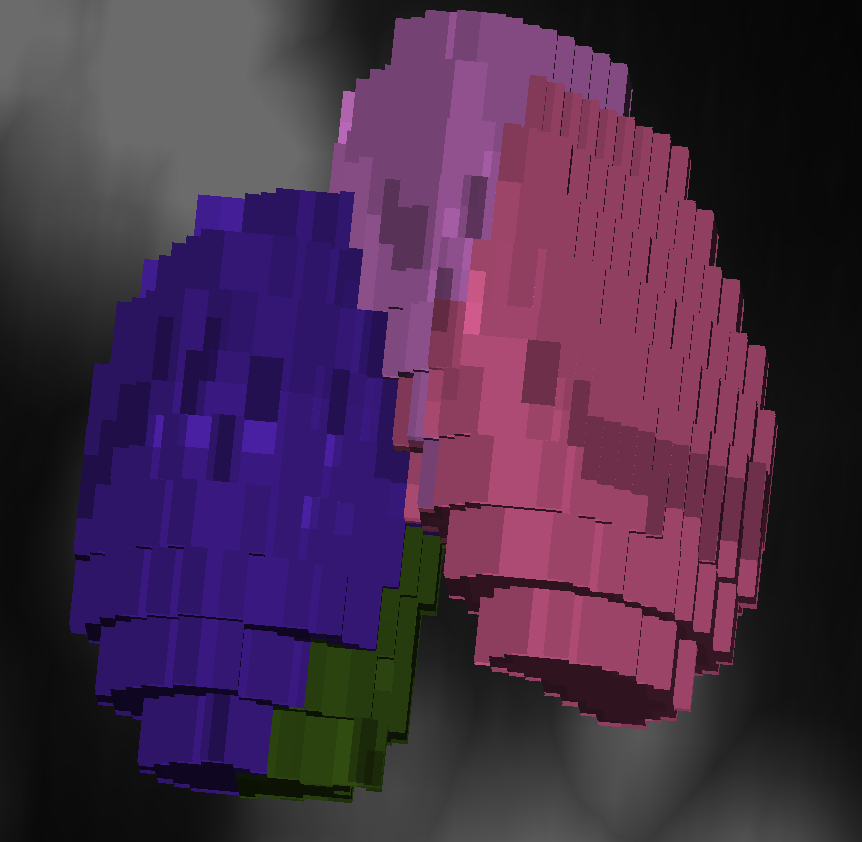</td>
<td width="33%" align="center">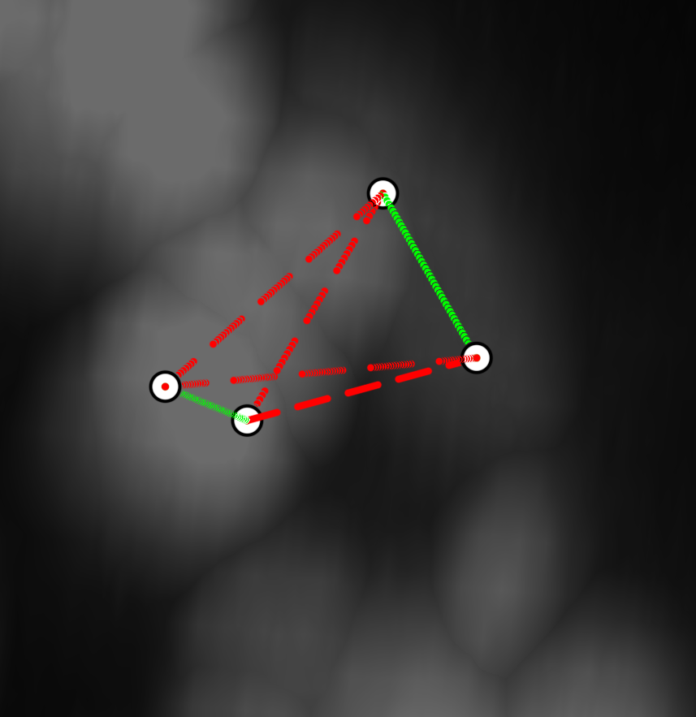</td>
<td width="33%" align="center">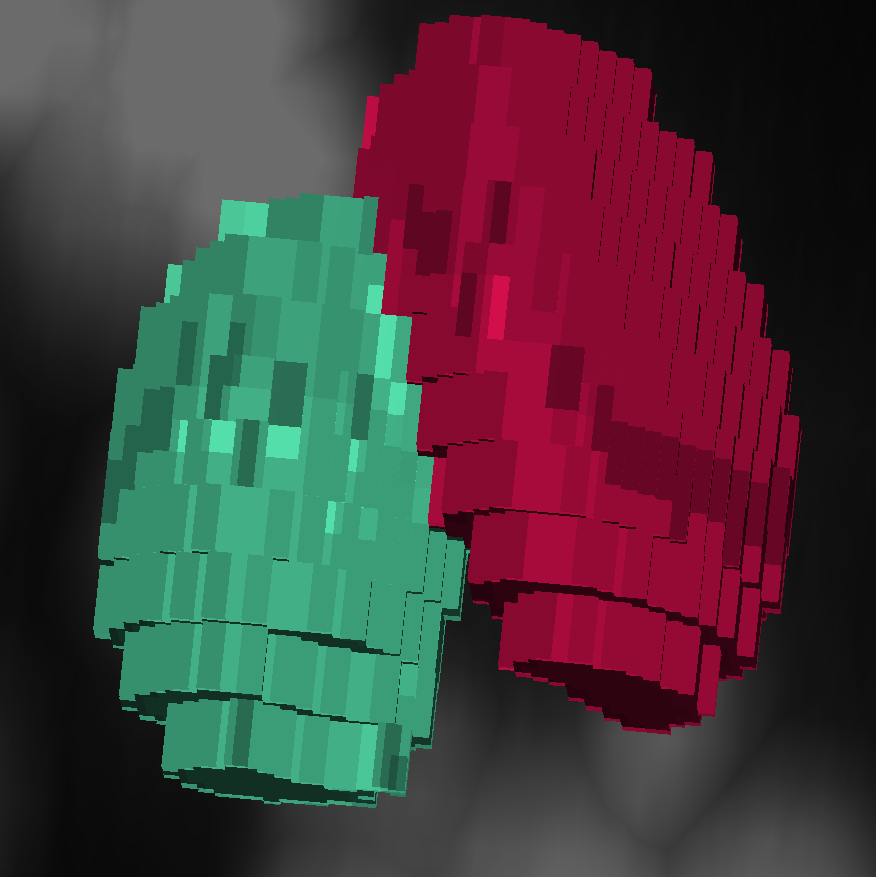</td>
</tr>
<tr>
<td align="center"><b>Atomic regions</b></td>
<td align="center"><b>Region adjacency graph</b></td>
<td align="center"><b>Grouped cell instances</b></td>
</tr>
</table>

The RAG is implemented in [`learned/stirnet/model/partition/rag.py`](learned/stirnet/model/partition/rag.py).

### Node representation

The current node representation combines multiple information sources rather than compressing a region into only its center:

- pooled native decoder (`D0`) features,
- mean/max statistics of dense geometric fields,
- raw/prior statistics,
- physical centroid normalized by the cell reference scale,
- normalized log-volume,
- optional learned morphology embeddings from local 3D region patches.

### Edge representation

The base interface feature vector contains eight explicit measurements:

1. separator mean,
2. separator maximum,
3. surface mean,
4. surface maximum,
5. foreground mean,
6. mean absolute SDF,
7. flow disagreement,
8. centroid-offset disagreement.

Optional morphology-aware edge embeddings can add learned local context around the complete A/B contact region.

This representation makes the central learned question explicit:

> **Do these two physically adjacent atomic regions belong to the same biological cell?**

---

## 7. Spatial Graph Reasoning and Partitioning

The [`SpatialRAGNetwork`](learned/stirnet/model/partition/graph_net.py) encodes each node, repeatedly exchanges messages over physical adjacency edges, and produces a logit for every candidate merge.

The message-passing block computes edge embeddings from:

```text
[node_A, node_B, raw interface features]
```

aggregates incident edge messages back into nodes, updates the node states, and finally classifies the refined edge representation.

```text
RAG node features
       |
       v
node encoder
       |
       v
message-passing blocks <---- interface / morphology evidence
       |
       v
final edge embeddings
       |
       v
spatial merge logits
       |
       v
global graph partition
       |
       v
corrected 3D instances
```

### Global partitioning

The current calibrated spatial configuration uses a **multicut** backend rather than making each edge decision independently. This matters because local pairwise predictions can be mutually inconsistent; the graph partition provides a globally coherent instance decomposition.

The current default configuration uses a calibrated spatial merge threshold of `0.845`. Historical positive-only union-find behavior remains available for comparison, while the final temporal path can use a separate partition backend.

### Structural invariants

The redesigned model is built around several useful invariants:

- a final instance is a union of adjacent atomic supervoxels;
- disconnected islands cannot silently share one instance ID;
- final masks are mutually exclusive because they come from one graph partition;
- one final center is extracted **inside** each final mask using the maximum-SDF voxel;
- watershed is deliberately non-differentiable, while dense geometry and RAG outputs receive direct supervision.

### Production split-only postprocessing

The promoted inference path adds an asymmetric source-core correction after the multicut result. Source-instance evidence may request a **split**, but is not allowed to create cross-partition merges.

This preserves an important safety property: unreliable source priors can reveal that a predicted region contains multiple source cores, but they are never interpreted as must-link evidence that forces two already-separated STIR-Net regions together.

The production implementation enforces this invariant explicitly in [`learned/stirnet/inference/spatial_pipeline.py`](learned/stirnet/inference/spatial_pipeline.py).

---

## 8. Experimental Temporal Reasoning

The temporal branch is implemented in the model package, but it remained an **experimental research direction** and was not promoted over the simpler spatial-STIR-Net + Trackastra production path.

Its goal is different from ordinary tracking. Instead of only linking already-finalized cells, it asks whether historical temporal evidence should alter an uncertain **current spatial decision**.

### Temporal detection graph

Historical detections are encoded as a graph and then pooled into tracklet hypotheses. The [`TemporalGraphEncoder`](learned/stirnet/model/temporal/graph_encoder.py) performs:

```text
historical detections
        |
        v
detection graph message passing
        |
        v
pool detections by tracklet
(mean + max + status embedding)
        |
        v
tracklet hypothesis graph
        |
        v
temporal tokens + reliability + salience
```

The implementation supports separate detection-level edges and tracklet-hypothesis edges rather than treating the entire history as one pooled vector.

### Instance tokenization

After the spatial graph is provisionally partitioned, one learned token is created per connected spatial instance. Instance features retain object-level geometry and learned spatial context rather than representing the cell only by a centroid.

### Local physical cross-attention

Current instance/RAG queries attend only to temporal tokens within a physical radius measured in cell-reference units. The attention mechanism includes:

- learned query/key/value projections,
- relative 3D positional bias,
- physical-distance gating,
- temporal salience,
- temporal reliability,
- a strict zero-message behavior when no local temporal evidence is available.

This avoids forcing a current cell to attend to a distant unrelated track simply because a temporal token exists somewhere in the frame.

### Reliability-gated temporal edge updates

Temporal reasoning does not blindly overwrite the spatial edge logits. It produces a bounded temporal candidate and interpolates from the spatial prediction only when local temporal support exists.

The temporal reasoner also predicts:

- instance existence evidence,
- split evidence,
- recovery evidence for temporally expected but spatially missing cells.

### Bounded local geometry refinement

Ambiguous splits/recoveries can request local native-resolution geometry refinement. The design intentionally restricts this to bounded ROIs rather than globally re-running a temporal model over the full volume.

### Why it remained experimental

Temporal fine-tuning and historical-correspondence experiments exposed an important information bottleneck: simply adding pooled history does not automatically provide sufficiently precise correspondence evidence to correct difficult spatial errors. Several alternatives were investigated, including per-supervoxel historical support, global-motion compensation, and correspondence-oriented features. The branch is preserved because the experiments are technically useful, but it is not presented here as a completed production tracker.

---

# Primary Tracking and Global-Motion Compensation

The promoted primary tracker is **Trackastra**, wrapped by [`src/tracking/trackastra/`](src/tracking/trackastra/).

The current implementation uses a two-pass bootstrap strategy:

```text
STIR-Net instance movie + raw movie
              |
              v
Trackastra pass 1
(source coordinates)
              |
              v
robust global-motion estimate
from pass-1 continuations
              |
              v
lazy zero-padded stabilization
(raw + instance movie)
              |
              v
Trackastra pass 2
(stabilized coordinates)
              |
              v
restore graph coordinates
back to source coordinates
```

The same loaded Trackastra model is reused for both passes.

### Why global-motion compensation?

Large common translation of the entire embryo/stage can dominate local cell displacement. A tracker should ideally reason about **relative biological motion**, not spend its capacity explaining the same global shift for every cell.

For temporal STIR-Net evidence, detections can be expressed relative to a target frame `t0` as:

```text
p_temporal(t | t0) = p_source_relative(t) - (G(t) - G(t0))
```

where `G(t)` is the cumulative global-motion estimate.

Important implementation constraints:

- global motion is estimated from **Trackastra predictions**, not annotations or ground truth;
- the final Trackastra graph is transformed back to the original BioHub coordinate system;
- visualization, stitching, and export therefore continue to operate in source coordinates;
- stabilization is an internal tracking operation rather than a permanent rewrite of the source data.

The public tracking result contains both Napari-compatible track rows and a parent graph for lineage relationships.

---

# Learned Track Reconciliation

The repository also contains [`learned/track_reconciler/`](learned/track_reconciler/), a separate research model intended to repair difficult breaks **after** a strong primary tracker has already produced mostly correct trajectories.

It is deliberately not designed as another frame-to-frame tracker.

The proposed architecture works on high-purity tracklets and candidate transitions:

```text
per-cell 3D fingerprint crop
(raw / mask / EDT / boundary-SDF / context)
                    |
structured track history
                    |
                    v
separate temporal encoders
(head / tail / pooled tracklet states)
                    |
                    v
high-recall candidate gate
                    |
                    v
edge-centric candidate representation
                    |
                    v
geometry-biased edge Transformer
                    |
                    +--> continuation
                    +--> appearance / termination
                    +--> explicit symmetric division hypotheses
                    |
                    v
constrained lineage decoder
```

The key idea is to reason over **candidate transition edges**, where many nearby edges are competing alternatives rather than homophilic neighbours that should all be averaged together.

This stage is still being finalized and should be considered research/prototype code.

---

# Dataset Curation and Annotation

Building the model required substantially more than training code. A dedicated [`dataset_curation/`](dataset_curation/) package was developed to run production inference, inspect failure cases, curate corrections, edit tracks, and keep annotations tied to the exact inference result that generated their instance IDs.

<table>
<tr>
<td width="34%" align="center">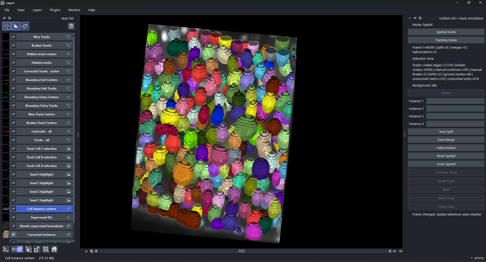</td>
<td width="33%" align="center">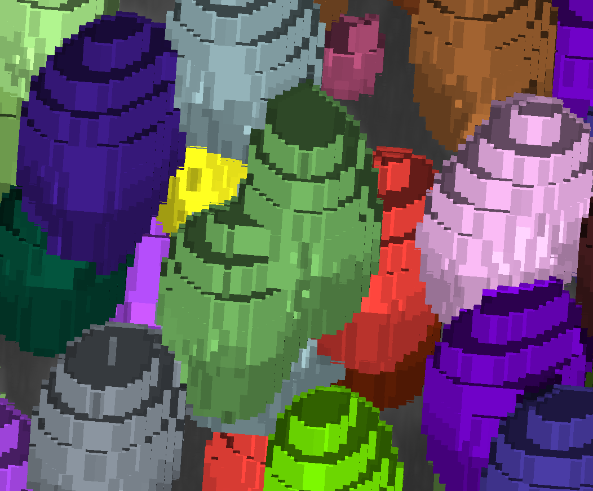</td>
<td width="33%" align="center">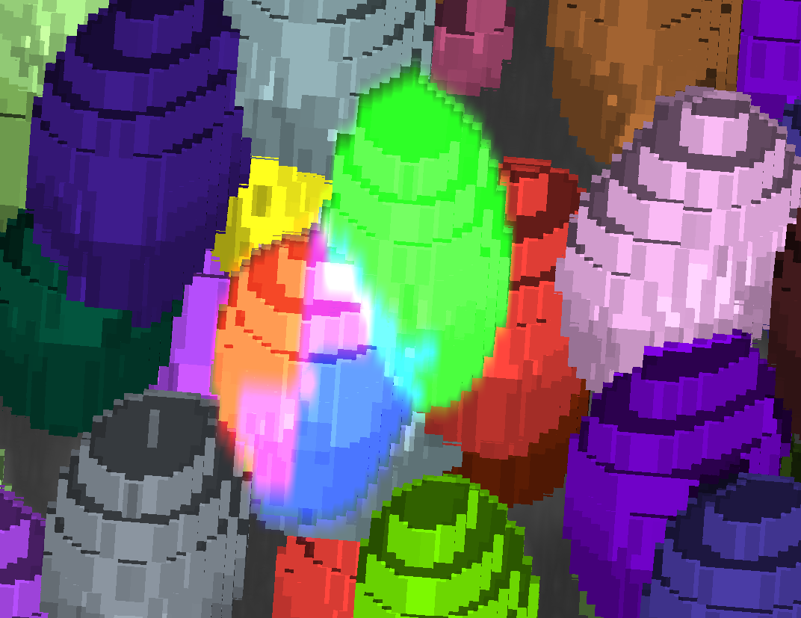</td>
</tr>
<tr>
<td align="center"><b>Dataset / inference overview</b></td>
<td align="center"><b>Segmentation failure inspection</b></td>
<td align="center"><b>Supervoxel-level correction</b></td>
</tr>
</table>

## Curation workflow

```text
raw BioHub volume
      |
      v
canonical STIR-Net inference
      |
      v
canonical supervoxel + final-instance cache
      |
      v
unified Napari annotator
      |
      +--> spatial split / hallucination corrections
      |
      +--> track continue / break corrections
      |
      +--> birth / lineage events
      |
      v
annotation set bound to exact inference ID
```

### Canonical inference cache

Each source volume has one canonical production inference cache. Annotation sets are bound to an immutable `inference_id`, preventing old annotations from silently attaching to regenerated instance IDs.

Persistent full-volume spatial movies are intentionally compact:

```text
movies/supervoxels.npy
movies/final_instances.npy
```

Raw intensity remains in the source Zarr. Large intermediate dense model outputs are not duplicated as permanent full-volume movies.

### Unified spatial annotation

The viewer supports, among other operations:

- atomic supervoxel visualization,
- supervoxel IDs placed at an interior EDT center,
- corrected cell-instance centers,
- split-seed selection,
- split saving,
- hallucination removal,
- spatial undo.

Spatial edits are authoritative. If a corrected instance removes a previous tracking detection, incident graph edges are invalidated rather than silently retained.

### Unified tracking annotation

Tracking inspection includes:

- broken/new-track diagnostics,
- boundary-entry and boundary-exit markers,
- corrected active track edges,
- manual continuation,
- manual breaks,
- component completion/hiding,
- undo,
- lineage/birth events in the saved annotation state.

### Pathological-volume guard

Some source volumes contain extremely large connected foreground components for which the classical source segmentation becomes prohibitively expensive or outside the intended regime. Dataset curation therefore performs an inexpensive connected-component check before entering expensive source segmentation and can record a volume as skipped rather than leaving a partially generated cache.

### Annotation progress

Saved progress can be inspected from the CLI without opening Napari. The tool reports spatial operations, track actions, birth events, ignored/deferred events, and compact frame ranges with saved annotation activity.

A useful caveat is that this reports **persisted annotation activity**, not every frame that a human visually reviewed but left unchanged.

---

# Research and Experimental Development

The `investigations/`, `experiments/`, `notebooks/`, and `legacy/` directories are intentionally preserved. They are not part of the clean active API, but they document how the architecture reached its current form.

The numbered STIR-Net investigations cover a progression including:

### Phase 1 — Ground-truth and dense-geometry validation

- validation of sparse ground-truth handling,
- controlled dense-geometry overfit experiments,
- diagnosis of conflicting geometry regularizers,
- removal/disablement of regularizers that degraded otherwise useful geometry.

### Phase 2 — Watershed and atomic-region design

- marker generation experiments,
- watershed failure analysis,
- calibration toward deliberate oversegmentation,
- validation of a supervoxel safety guard,
- investigation of pathological tiny regions.

### Phase 3 — Spatial RAG

- construction of RAG training cases,
- controlled RAG overfit tests,
- learned interface decisions,
- morphology-aware node/edge context,
- comparison of graph partitioning strategies,
- promotion of multicut for the calibrated spatial path.

### Phase 4 — Full-volume production inference

- tiled dense inference,
- memory profiling,
- GPU EDT and geometry acceleration,
- CPU/GPU lookahead scheduling,
- source-instance caching,
- production split-only postprocessing,
- handling of pathological frames/volumes.

### Phase 5 — Temporal modeling

- temporal merge-case preparation,
- object/tracklet reasoning experiments,
- curated real temporal fine-tuning,
- global-motion-aware temporal coordinates,
- pooled-history experiments,
- correspondence-oriented historical shape support.

### Phase 6 — Human curation

- unified spatial + temporal annotation,
- editable supervoxel corrections,
- corrected-track graph maintenance,
- track/lineage event storage,
- progress reporting,
- canonical inference/annotation version binding.

This investigation trail is part of the project: many architectural decisions exist because a simpler or earlier version was tested and found insufficient.

---

# Results and Evaluation Philosophy

The strongest evidence currently available in this public repository is **qualitative and diagnostic**, not a final standardized competition benchmark.

The project therefore deliberately avoids statements such as “state of the art” or “X% accuracy” unless the exact metric, ground truth, and evaluation protocol are available.

## Spatial behavior

The spatial pipeline is designed to correct local source-segmentation errors by:

1. predicting raw-image-conditioned dense geometry,
2. creating safer atomic regions,
3. classifying physical interfaces between those regions,
4. solving a coherent graph partition,
5. applying a conservative source-core split-only final correction.

The `assets/results/` and `assets/supervoxels/` examples show the qualitative effect on real 3D frames.

## Tracking behavior

The tracking visualization uses the promoted Trackastra-based primary-tracking path over corrected instance masks. The project-specific contribution in this stage is the surrounding tracking pipeline: source-coordinate execution, global-motion bootstrap, stabilization, second-pass inference, coordinate restoration, diagnostics, curation integration, and the experimental learned-reconciliation work.

## Runtime instrumentation

Production spatial inference records per-frame:

- source instance count,
- multicut instance count,
- final instance count,
- split candidates/applied splits,
- preparation time,
- preparation wait time,
- amount of CPU preparation hidden behind GPU work,
- inference time,
- postprocessing time,
- total frame time,
- peak allocated GPU memory.

The production scheduler uses one spawned CPU process to prepare frame `t+1` while the main process owns CUDA inference for frame `t`, keeping host-memory lookahead bounded to one frame.

## Competition score

At the time this README was prepared, the project had **not yet been presented with a final official Kaggle leaderboard score**, so no leaderboard claim is made here.

---

# Generalization and Limitations

This project exposed several limitations that are important to state explicitly.

### 1. Development-domain bias and dataset diversity

A large amount of STIR-Net development occurred around one visually cleaner volume regime. Only later, after inspecting the broader competition test set, did it become clear that the evaluation data contained substantially different morphology, density, clustering, contrast, and noise characteristics. Strong performance on the main development regime therefore did not establish generalization across the full competition distribution.

The four examples below illustrate the different regimes encountered during that later analysis. They are **representative examples used during development, not official dataset classes**. Discovering this degree of variation was one of the main reasons not to continue scaling the custom STIR-Net architecture purely for the competition: the remaining work was no longer just refinement of one model, but robust generalization across qualitatively different imaging regimes.

<table>
<tr>
<td width="25%" align="center">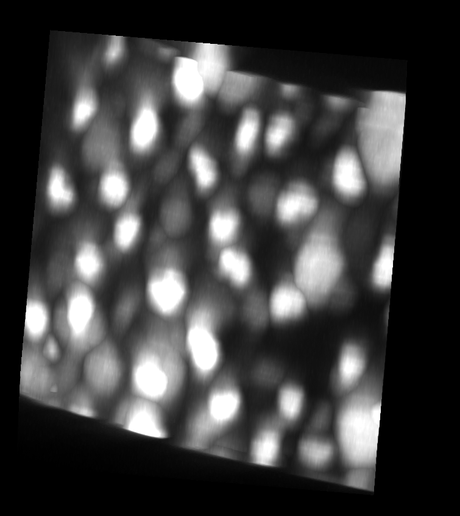</td>
<td width="25%" align="center">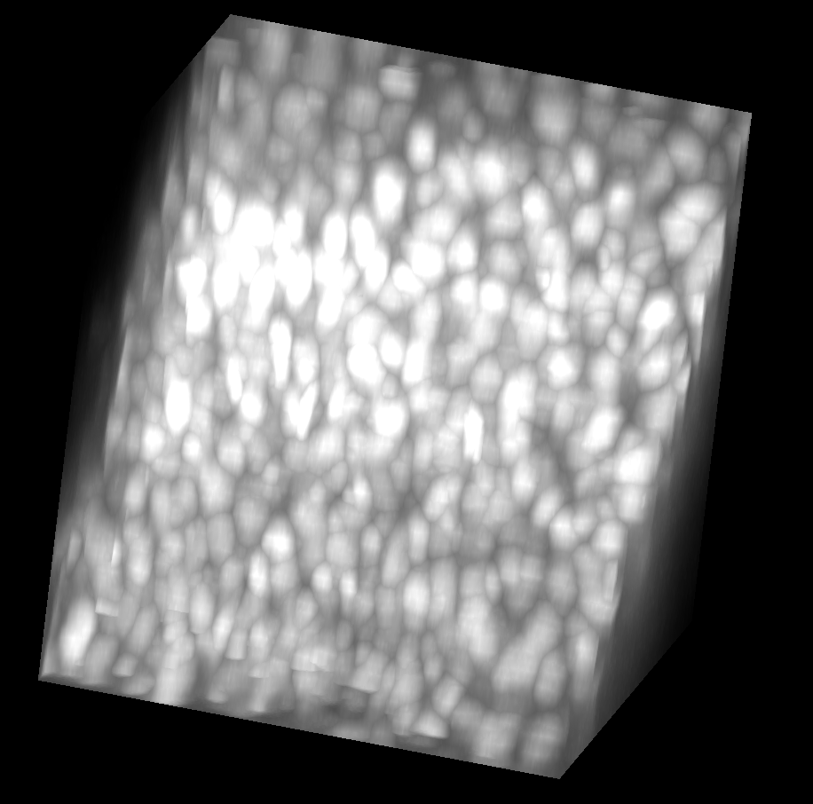</td>
<td width="25%" align="center">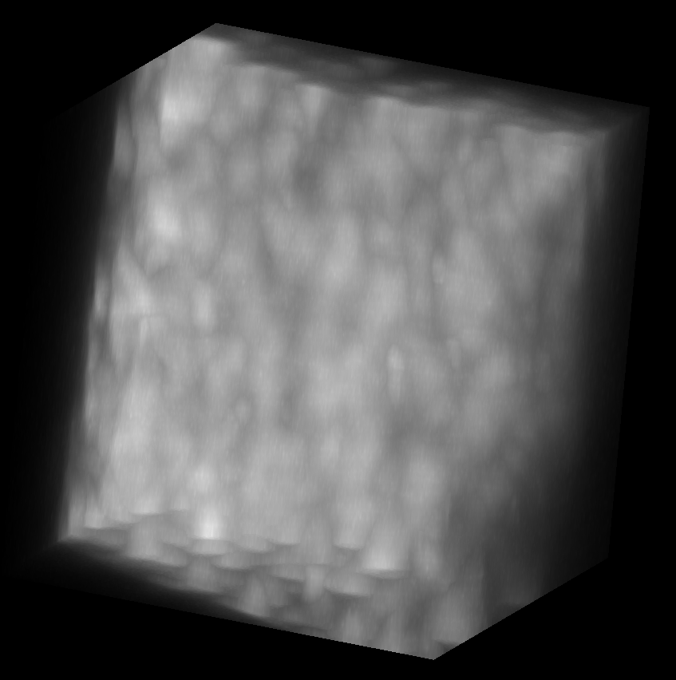</td>
<td width="25%" align="center">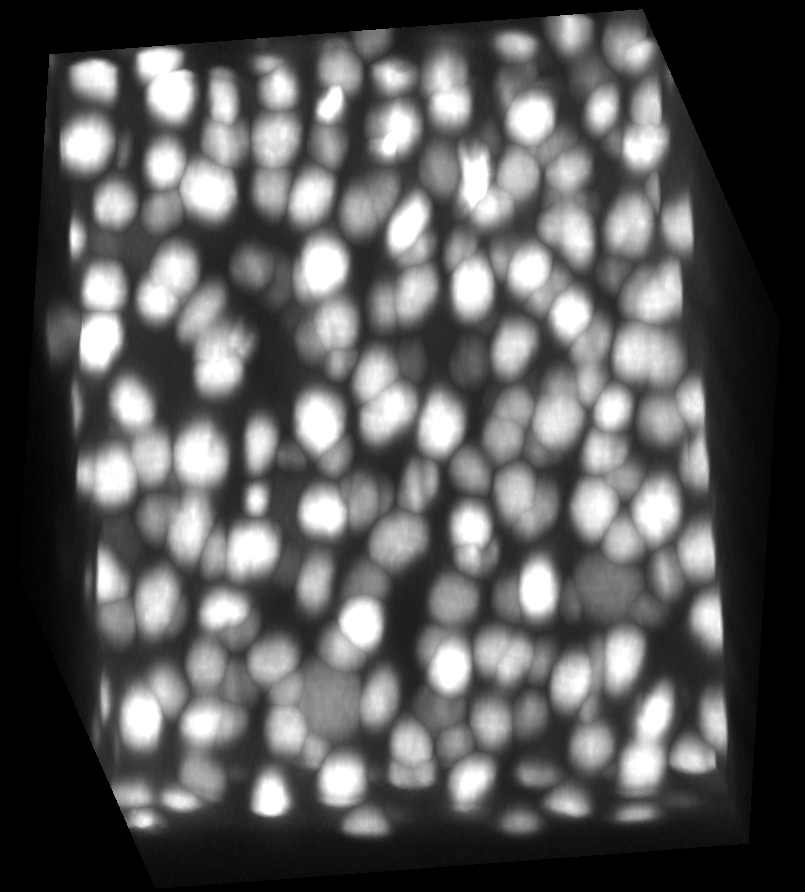</td>
</tr>
<tr>
<td align="center"><sub>Representative regime A</sub></td>
<td align="center"><sub>Representative regime B</sub></td>
<td align="center"><sub>Representative regime C</sub></td>
<td align="center"><sub>Representative regime D</sub></td>
</tr>
</table>

### 2. Sparse supervision

The BioHub training data provide sparse lineage annotations relative to the full 3D+t volume. This makes end-to-end supervised validation expensive: processing a complete volume for a small amount of annotated ground truth can be computationally inefficient.

### 3. Atomic proposal quality still matters

The RAG can merge extra fragments, but it cannot perfectly recover when an atomic supervoxel already crosses a true biological boundary. Much of the watershed/safety-guard work exists to protect this invariant.

### 4. Temporal STIR-Net was not completed as a production model

The temporal architecture is implemented and extensively investigated, but it did not reach the same level of validation as the spatial branch. In particular, historical information must be correspondence-specific enough to change the correct local graph edge; generic pooled history often does not provide that precision.

### 5. Track reconciliation remains in development

The learned track reconciler has a substantial architecture and testable components, but the active production pipeline explicitly marks this stage as still being finalized.

### 6. Mature alternatives changed the research direction

Later experiments with mature spatial-temporal tools such as Cellpose + Ultrack showed that several error modes motivating additional custom STIR-Net development could be addressed effectively without continuing to expand the bespoke temporal architecture. Given the remaining competition time and the diversity of test regimes, continuing purely for a hoped-for leaderboard advantage was no longer justified.

That conclusion is treated as a research result rather than hidden: the repository preserves the architecture, experiments, and tooling because they remain useful demonstrations of ML system design and failure-driven iteration.

---

# Repository Structure

```text
cell-tracking/
|
|-- assets/                    README / portfolio visual assets
|   |-- architecture/
|   |-- dataset_curation/
|   |-- dataset_types/
|   |-- inputs/
|   |-- predicted_prior/
|   |-- RAG/
|   |-- results/
|   `-- supervoxels/
|
|-- src/                       active production pipeline components
|   |-- source_instances/      preprocessing + source segmentation
|   |-- tracking/              primary tracking implementation
|   |   `-- trackastra/        two-pass Trackastra + global motion
|   |-- pipeline/              stage composition and contracts
|   |-- io/                    active data I/O
|   `-- diagnostics/
|
|-- learned/
|   |-- stirnet/               STIR-Net model, training and inference
|   |   |-- model/
|   |   |   |-- spatial/
|   |   |   |-- geometry/
|   |   |   |-- partition/
|   |   |   |-- instances/
|   |   |   |-- temporal/
|   |   |   `-- refinement/
|   |   |-- training/
|   |   |-- inference/
|   |   `-- data/
|   |
|   |-- track_reconciler/      learned track-repair research model
|   `-- local_merge_cnn/       earlier learned experiments
|
|-- dataset_curation/          production inference + unified annotation
|-- investigations/            numbered research investigations
|-- experiments/               experimental evaluation / training code
|-- analysis/                  analysis utilities
|-- diagnostics/               debugging / inspection tools
|-- notebooks/                 development notebooks / proof-of-path artifacts
|-- kaggle/                    competition-specific execution/export work
|-- modal/                     cloud-execution utilities
|-- legacy/                    superseded classical/earlier implementations
|
|-- pyproject.toml
`-- requirements.txt
```

The distinction is intentional:

- **active implementation** lives primarily under `src/`, `learned/`, and `dataset_curation/`;
- **investigations/experiments/notebooks** preserve the research path;
- **legacy/** contains superseded approaches kept for reproducibility and development history.

---

# Installation

## Requirements

- Python **3.11+**
- PyTorch
- NumPy / SciPy / scikit-image
- pandas / NetworkX
- Zarr / Dask
- Trackastra
- napari for interactive curation
- CUDA is strongly recommended for STIR-Net inference/training

The repository currently pins a reproducibility-oriented environment in [`requirements.txt`](requirements.txt), including a CUDA 13.x CuPy target.

## Setup

```bash
git clone https://github.com/RJKRanathunga/cell-tracking.git
cd cell-tracking

python -m venv .venv
```

Activate the environment, then install dependencies and the repository package:

```bash
pip install --upgrade pip
pip install -r requirements.txt
pip install -e .
```

> The pinned PyTorch/CuPy versions reflect the development environment. If your CUDA/toolchain differs, install a compatible PyTorch and CuPy build for your system rather than assuming the exact pins are portable to every machine.

---

# Usage

## 1. Dataset-curation CLI

The most complete repository-level workflow is exposed through `dataset_curation`:

```bash
python -m dataset_curation status --split all
python -m dataset_curation infer --split train --count 5
python -m dataset_curation infer --split train --id <volume-id>
python -m dataset_curation annotate --next
python -m dataset_curation annotate --resume
python -m dataset_curation annotate --id <volume-id>
python -m dataset_curation progress --split train --id <volume-id>
python -m dataset_curation progress --split train
python -m dataset_curation view-source --id <volume-id>
```

The curation package owns the canonical production cache and annotation layout.

## 2. Direct STIR-Net spatial inference

The inference API can be used directly when a compatible checkpoint is available:

```python
from learned.stirnet.inference import (
    SpatialInferenceConfig,
    load_spatial_runtime,
    run_parallel_spatial_volume,
)

config = SpatialInferenceConfig()

runtime = load_spatial_runtime(
    "path/to/checkpoint.pt",
    device="cuda",
    config=config,
)

result = run_parallel_spatial_volume(
    "path/to/sample.zarr",
    runtime,
    config=config,
    sample_id="example",
)

print(result.frame_count)
print(result.total_seconds)
```

Use the `on_frame` callback when direct inference needs to persist or inspect per-frame `SpatialFrameResult` objects. For the standard project workflow, prefer `dataset_curation`, which owns canonical persistence.

## 3. Primary Trackastra tracking

The production tracker API is exposed from `src.tracking.trackastra`:

```python
from src.tracking.trackastra import TrackastraConfig, run_trackastra

tracking = run_trackastra(
    raw_movie,       # (T, Z, Y, X)
    instance_movie,  # (T, Z, Y, X)
    config=TrackastraConfig(),
)

napari_tracks = tracking.napari_tracks
parent_graph = tracking.napari_graph
```

When global-motion compensation is enabled, `run_trackastra` automatically executes the two-pass bootstrap pipeline and returns the final graph in source coordinates.

## 4. Source-only inspection

Source data can be inspected without importing PyTorch:

```bash
python -m dataset_curation view-source --id <volume-id>
```

This is useful for dataset inspection and debugging source-segmentation failures independently of STIR-Net.

---

# Data Contract

## BioHub volume shape

The active inference path expects a 4D image in:

```text
(T, Z, Y, X)
```

order.

The production spatial configuration uses physical spacing in `(Z, Y, X)` order.

## Canonical curation layout

The curation package expects each source volume to have a stable local identity and stores generated data separately from the raw source.

A representative generated layout is:

```text
preprocessed/<split>/<volume>/
|-- movies/
|   |-- supervoxels.npy
|   `-- final_instances.npy
|-- cells/
|   `-- tXXX.csv
|-- cells_all.csv
|-- spatial_summary.json
|-- _SPATIAL_SUCCESS.json
|-- curation_manifest.json
`-- trackastra/
    |-- track_graph.pkl
    |-- napari_tracks.npy
    |-- napari_graph.json
    |-- tracks.csv
    `-- summary.json
```

Annotations are stored separately and bound to the canonical inference ID.

## Data redistribution

The raw BioHub competition data and external datasets used during research are **not intended to be redistributed through this repository**. Obtain them from their original sources and configure the local dataset root accordingly.

---

# Testing

The repository contains smoke tests and package-level tests for the major learned components.

### STIR-Net redesigned model smoke test

```bash
python -m learned.stirnet.model.smoke_test
```

This exercises spatial, temporal, graph-partition, historical, and local-refinement paths on synthetic inputs.

### Dataset-curation tests

```bash
pytest dataset_curation/tests -q
```

### Track-reconciler smoke test and tests

```bash
python -m learned.track_reconciler.smoke_test
pytest learned/track_reconciler/tests -q
```

Additional tests are present under the STIR-Net package and individual investigation code paths.

---

# Hardware and Runtime Notes

Development was performed with a strong emphasis on fitting a substantial 3D model into limited local GPU memory while retaining a path to larger cloud GPUs.

The current codebase includes:

- activation checkpointing,
- tiled dense inference,
- tile overlap and halo handling,
- mixed-precision runtime support,
- peak VRAM instrumentation,
- GPU EDT support where applicable,
- one-frame CPU preparation lookahead,
- bounded host-memory scheduling,
- explicit local/cloud runtime profiles in historical model code,
- Modal utilities for cloud execution.

The production spatial runtime loads serialized model configuration directly from the checkpoint and validates compatibility rather than silently constructing a different architecture around old weights.

---

# External Components and Research Influences

This project contains substantial original pipeline/model/tooling work but also deliberately builds on strong open-source research systems.

## Trackastra

Trackastra is used as the **primary temporal tracker** in the promoted pipeline. This repository adds project-specific integration, global-motion bootstrapping, coordinate handling, curation, and downstream reconciliation research around it.

- Project: https://github.com/weigertlab/trackastra

## napari

napari is used as the interactive foundation for 3D visualization and human annotation.

- Project: https://napari.org/

## Spatial-model research influences

The redesigned STIR-Net architecture drew ideas from several families of instance-segmentation methods:

- **Omnipose** — distance-field and flow-style geometric representation,
- **NucMM** — complementary foreground / contour-separator / distance evidence,
- **NISNet3D** — learned 3D geometric/vector evidence,
- **PlantSeg** — oversegmentation followed by graph-based agglomeration/partitioning,
- embedding-style instance segmentation — centroid-offset evidence,
- local/masked attention — restrict expensive reasoning to relevant local geometry.

These are design influences rather than copied end-to-end architectures.

## Core software dependencies

The implementation also relies on PyTorch, NumPy, SciPy, scikit-image, pandas, NetworkX, Zarr, Dask, CuPy, matplotlib, and related scientific Python tooling listed in [`requirements.txt`](requirements.txt).

---

# Project Status

| Component | Status | Notes |
|---|---|---|
| Classical/source instance generation | Active | Provides fallible priors for STIR-Net |
| STIR-Net dense geometry | Active / mature research path | Used by production spatial refinement |
| Watershed + atomic supervoxels | Active | Calibrated toward safe oversegmentation |
| Spatial RAG | Active | Learned interface reasoning |
| Multicut spatial partition | Active | Current promoted spatial backend |
| Source-core split-only postprocess | Active | Conservative final split correction |
| STIR-Net temporal branch | Experimental | Implemented and investigated, not promoted as final tracker |
| Trackastra primary tracking | Active | Two-pass global-motion-aware production path |
| Learned track reconciler | Research / in development | Explicit final-repair stage, not yet finalized |
| Dataset curation / annotation | Active | Canonical inference + unified spatial/track editing |
| Final Kaggle leaderboard benchmark | Not reported here | No benchmark claim made |

## Why active STIR-Net development was concluded

The original competition objective justified aggressive experimentation while there appeared to be a plausible custom-model advantage. The spatial branch produced a substantial and technically useful system, but later analysis changed the decision:

- test volumes exhibited broader morphology/noise regimes than the main development volume;
- the custom temporal branch still required significant research;
- mature spatial-temporal alternatives addressed several remaining failure modes;
- the remaining competition time was limited relative to the uncertainty of achieving a unique leaderboard advantage.

Rather than continue from sunk cost, the project was frozen as a documented research/engineering artifact. The codebase, experiments, tooling, and failure analyses are retained because they capture the most valuable part of the work: **how the system was designed, challenged, debugged, and revised**.

---

# License

The original source code in this repository is licensed under the **[Apache License 2.0](LICENSE)**.

Datasets, pretrained models, third-party libraries, and externally developed components used by this project remain subject to their respective licenses and terms of use. The Apache-2.0 license applies only to the original code and documentation covered by this repository's `LICENSE` file.

---

## Notes for Readers

This is a research repository rather than a minimal library package. If you are reviewing it as a portfolio project, the most representative paths are:

- [`learned/stirnet/model/`](learned/stirnet/model/) — redesigned STIR-Net architecture
- [`learned/stirnet/inference/`](learned/stirnet/inference/) — promoted tiled spatial inference
- [`src/tracking/trackastra/`](src/tracking/trackastra/) — global-motion-aware primary tracking
- [`dataset_curation/`](dataset_curation/) — production curation and annotation tooling
- [`investigations/stirnet/`](investigations/stirnet/) — architecture/debugging research trail
- [`learned/track_reconciler/`](learned/track_reconciler/) — experimental learned track repair

